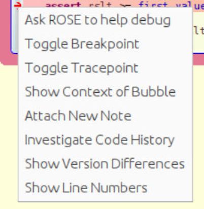

# Warning:
By following the instructions below to install and use ROSE, you may possibly know the author information.
 
# Two methods to try ROSE
## Method 1: Import the .ova file to a virtual machine workstation
We have already installed all the dependencies and ROSE on a virtual machine, and exported it as a .ova file.

Link: https://drive.google.com/file/d/1YODlcpmLATsOvKDtsrK7MujWJaEOzR3R/view?usp=sharing

You can download it and import into a virtual machine workstation.

After you import it successfully, enter the following commands to run Code Bubbles:
```
$ cd ~/CodeBubbles
$ java -jar bubbles.jar
``` 
And then, start from Step 4 of Method 2 to try ROSE.

## Method 2: Install on your own machine
### Dependencies
* Ubuntu: version >= 22.04
* Java:  version >= 17.0.4
* Eclipse: version >= 2022-06
### Instructions:
To try ROSE, you should follow these four steps.
* Step 1: Import demo project
* Step 2: Install Code Bubbles
* Step 3: Install ROSE
* Step 4: Run ROSE with the demo project

More detailed instructions are as follows.

### Step 1: Import demo project

* Run Eclipse.

* File -> Open Projects from File System. 

  

* Import source -> Directory.

  

* Select "user_study" directory in this repo.

  

* Shutdown Eclipse.

### Step 2: Install Code Bubbles

```
# install_dir is the directory where you want to install Code Bubbles and ROSE.
$ mv ./bubbles.jar ${install_dir} 
$ cd ${install_dir}  
$ java -jar bubbles.jar
```
* Select Eclipse Installation Directory.
  
  
  
* Select Eclipse's workspace.
  
  
  
* Other options.

  * Theme：

    

  * User Metrics：

    

  * Bug Report：

    

After Select "OK" for all above options, you should see the interface of Code Bubbles. 


### Step 3: Install ROSE

* On the top of the navigation bar, select the dropdown icon -> Manage Plugins.

  

* Select "ROSE".

  

* Select "YES".

  

* Restart Code Bubbles.


### Step 4: Run ROSE with the demo project
#### Step 4.1: Run the project

  *  In the `Action Button Area` in the upper right corner of the screen, click the small button on the left side of the `Debug` area.
  
     

  * A new bubble will pop up on the screen, asking you to fill in some basic information about launching, as shown in the image below.

    

  * Disable the option for "Stop in Main" . And then click "Save" ->  "Debug" . Then you can switch to the debug perspective.

  * The interface of the debug perspective is shown in the figure below.

    

  * Click the `Run Button` on the left of the first line, and the demo project will be compiled and run automatically. 

  * After the compilation is finished, you will see the graphical interface be started successfully. 
    

#### Step 4.2: Select "Tutorial" and Trigger the bug

  *  Select Tutorial in the graphic interface, and you should see the interface as shown below.

     

  * This is a program for computing the maximum of two numbers.

  * Enter the first number : 2022,  the second number: 6.18.

  * Click "COMPUTE MAX" button. And you will see the program stopped before an assertion failed.

    To the left of the line, we will see a small red arrow -> pointing to this statement.

    And the text in this line is highlighted with a red background, as shown in the figure below.

    

    This shows that ROSE has caught a failed assertion and is ready to help us.
    

#### Step 4.3: Invoke ROSE

  * Right-click the red arrow and you will see the following menu. 

    

  * Click on the first item - Ask ROSE to help debug. A bubble as shown below will appear on the screen, asking you to describe the problem you encountered.

    

  * In the case of assertion failure, ROSE has filled the Problem box for you by default. That is, we expect ``Assertion should not have failed``.

#### Step 4.4: Suggest repairs

  * Now you can directly click ``Suggest Repairs`` to get the suggestions given by ROSE. 

  * Wait for a while and you will see the following Repair Suggestion Bubble pop up, which lists the repair suggestions that ROSE can give.

    

#### Step 4.5: Preview Repairs

  * In the Repair Suggestion Bubble, each suggestion is presented in the natural language, including information such as the specific repair method, the name of the fixed function, and the repair location. 
  * ROSE may give multiple repair suggestions on one problem. It is your job to decide which of the repairs is correct (or none of them is correct) . 
  * ROSE allows you to quickly preview, compare, and try each repair suggestion. 
  * Right click on any suggestion and the pop-up menu looks like this:
    
  * You can click on the first item “Preview repair xxx" to compare the code before and after this repair. 
    As an example, the preview for the first suggestion is shown in a new bubble as the following figure.
    
    The preview bubble is divided into left and right parts:
      - The left side represents the original code, and the changed characters are in green. 
      - The right side represents the changed code, and the changed characters are in red.

#### Step 4.6: Make Repair

  * After previewed a piece of suggestion, you may right click on the suggestion and then choose the second item "Make repair xxx" as shown below. 

    

  * And ROSE will automatically finish the repair in the code for you.

    

#### Step 4.7: Rerun the project

  * Then, click the button shown below in the `Buttons Bubbles` to  terminate the current execution.
    

  * To check whether the new code works, click the Run button to recompile with the new changes. After this, the repaired program will run.

    

  * Continue to select Tutorial in the interface, re-enter the two values in the text boxes: 2022 and 6.18. 

  * Click COMPUTE MAX, you can see the program outputs 2022.0 this time (as shown in the figure below), which is in line with our expectations.

    